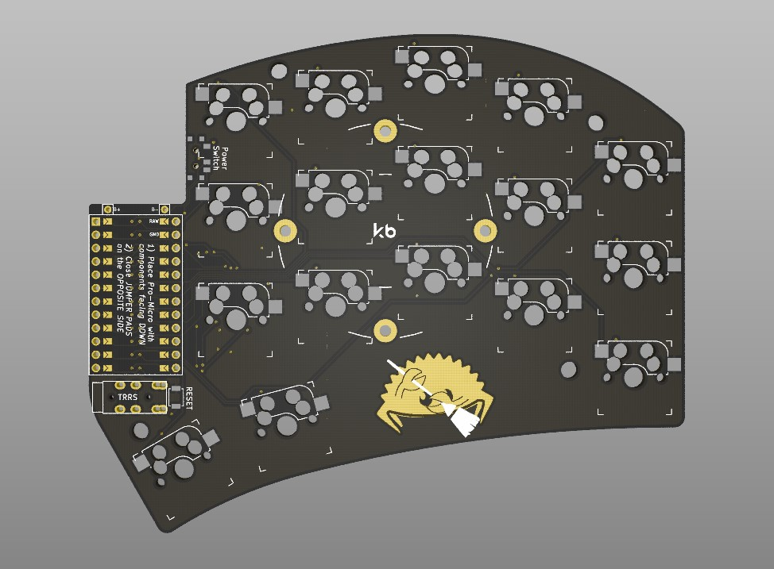
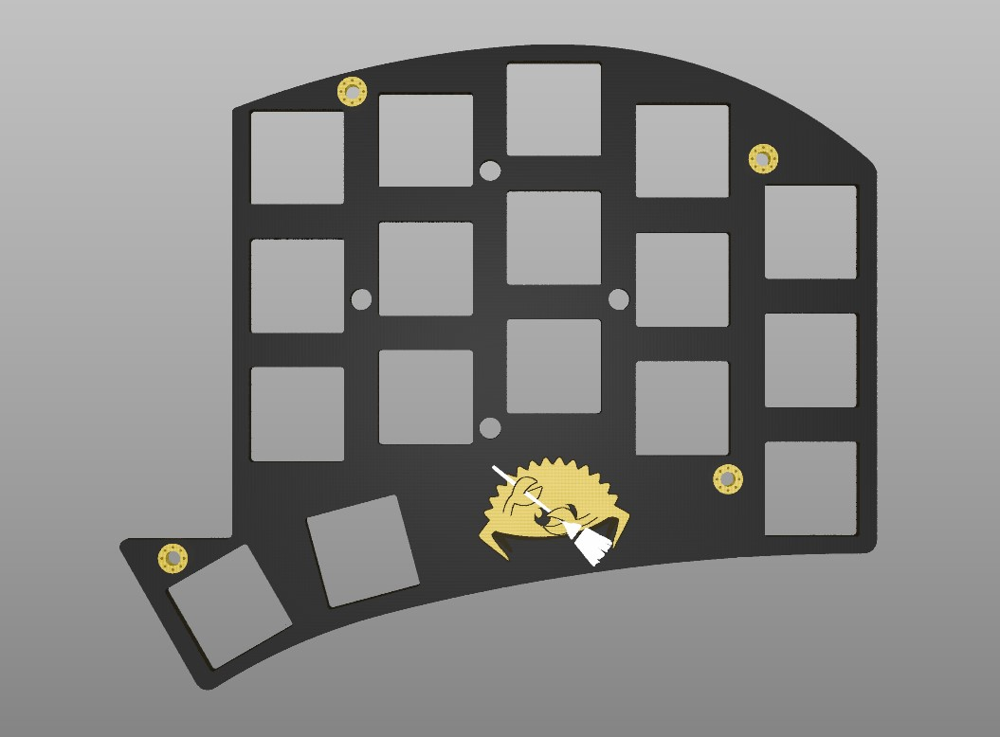

| Bottom plate | PCB | Switch Plate |
| --- | --- | --- |
|  |  |  |

# Notes:

- **DRILL TIME FEE**: When ordering PCBs with complex shapes like the switch plate and bottom plate, it is possible that the factory will ask for additional fees.

# PCB Hardware Kit (for both sides)
## Required
- 1x PCB Kit
- 2x promicro compatible boards or nice!nanos
- 34 MX switches
- 34 Kailh hotswap sockets
- 34 keycaps

### Optional:
- 2x Battery (required only for wireless; 301230 / 301228)
- 2x Power switches (recommended for wireless; MSK 12C02)
- 2x reset switches ([B3U-1000P(M)](https://github.com/davidphilipbarr/Sweep/issues/20))

# Case Hardware Kit (for both sides)

## Required:  
- 16x M2 Screws
- 8x M2 Spacers. (Max diameter: 3mm, Length: 6-8mm)
- 8-12x Silicone feet stickers

### Optional:
- 2x Splitkb tenting puck
- 2x Manfrotto MP3-BK tripods
